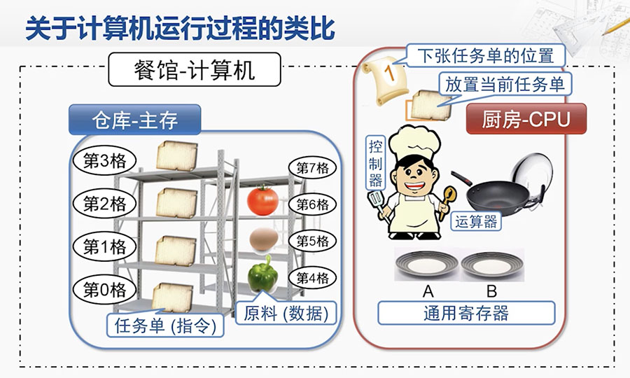
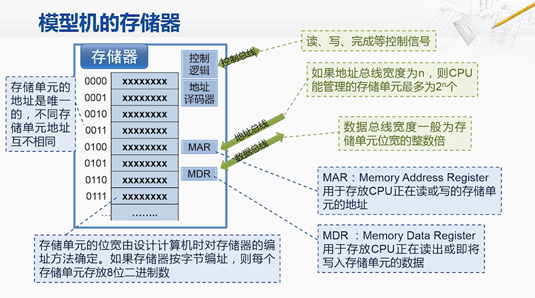
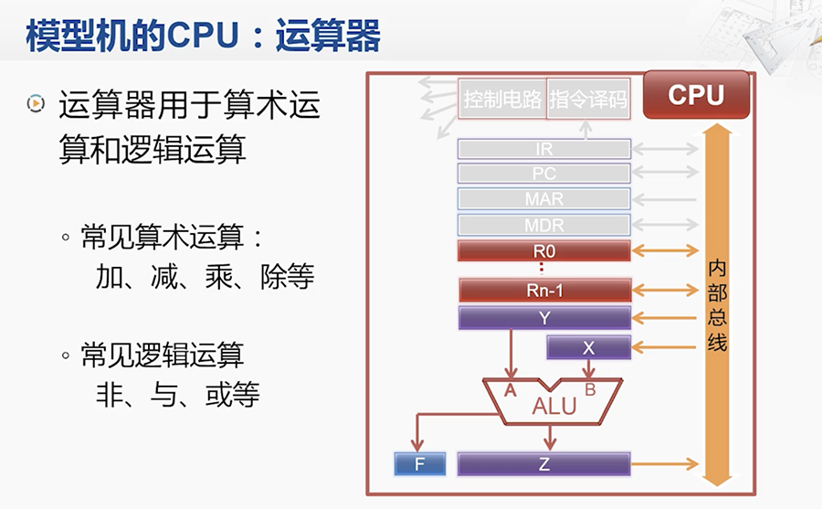
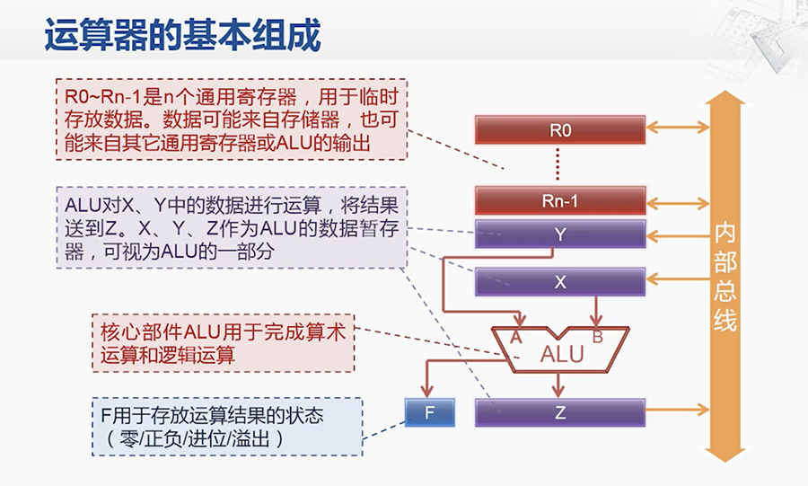
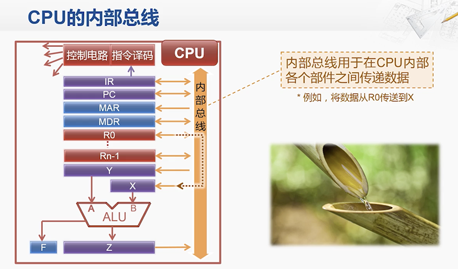
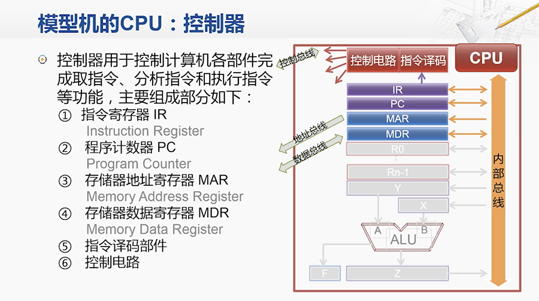
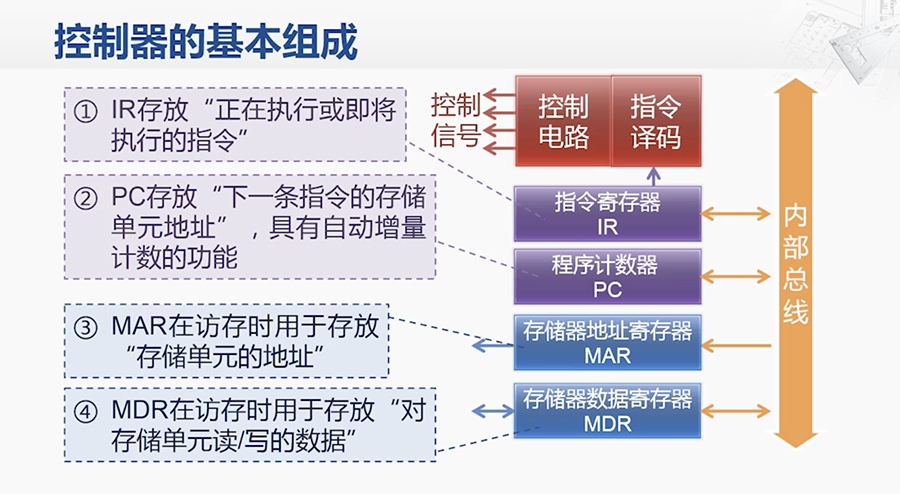
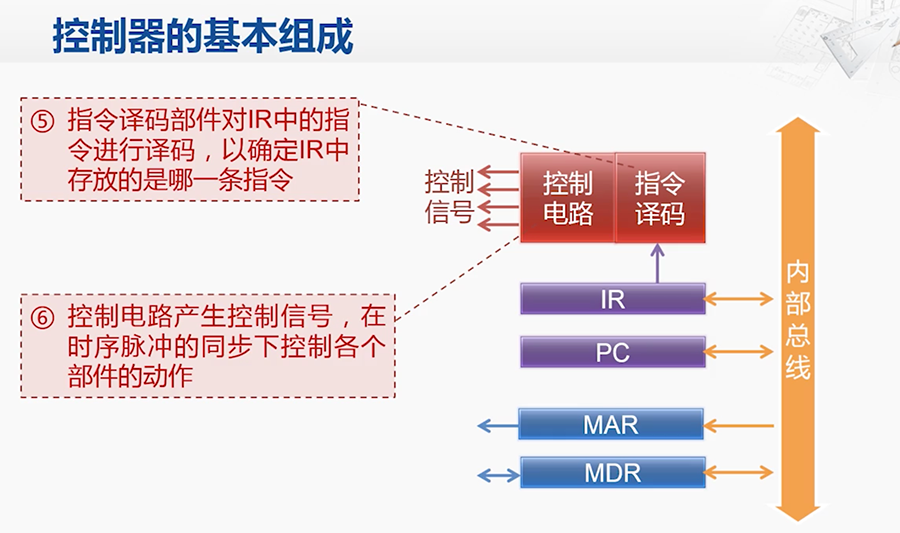

# 计算机基本结构

## 目录

* 电子计算机的兴起
* 冯诺依曼结构的要点
* 冯诺依曼结构的小故事
* 计算机结构的简化模型
* 计算机执行指令的过程
* 计算机输入和输出
* 冯诺依曼结构和具体实现

## 内容

### 电子计算机的兴起

* ABC 阿塔纳索夫·贝里 计算机
* ENIAC 世界上第一台通用电子计算机
* EDVAC 存储程序式计算机（冯·诺依曼）

### 冯诺依曼结构的要点

计算机的组成部分：
* 运算器 CA：central arithmetical
* 控制器 CC：central control
* 存储器 M：memory
* 输入设备 I：input
* 输出设备 O：output

`数据`和`程序`都以`二进制`的形式不加区分的存储在存储器中。

### 冯诺依曼结构的小故事

### 计算机结构的简化模型

模型机，目前包含了`CPU`和`存储器`两大布局，中间通过`系统总线`相连。
系统总线又被细分为：控制总线、地址总线 和 数据总线 三个部分。

### 计算机执行指令的过程

计算机执行一条指令的步骤：
1. 取指（Fetch）
2. 译码（Decode）
3. 执行（Execute）
4. 回写（Write-back）

执行指令的示例：

指令格式：ADD R0,[6]
指令功能：通用寄存器R0的内容 + 地址为6的存储单元的内容 = 运算结果 （结果再存储到R0中）

### 计算机输入和输出

### 冯诺依曼结构和具体实现

