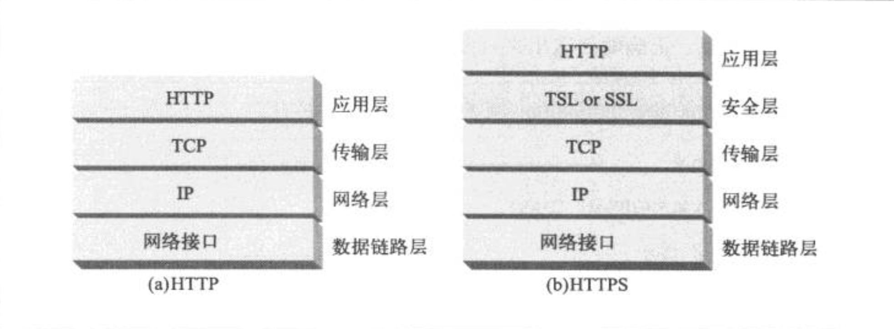

# 第一部分
HTTP: Web 的基础

主要概述HTTP协议，Web的基础构件以及HTTP的核心技术。

1. HTTP概述
2. RUL与资源
3. HTTP报文
4. 连接管理

## 第一章 HTTP概述

* Web 客户端与服务器如何通信
* (Web内容的) 资源来自何方
* Web 事务是怎样工作的
* HTTP通信所使用的报文格式
* 地城TCP网络传输
* 不同的HTTP协议变体
* 部分HTTP构架组件

#### 数据格式
MIME常见的有如下分类：
* text/html => HTML格式的文本文档
* text/plain => 普通的ASCII文本文档
* image/jpeg => JPEG图片
* image/gif => GIF图片
* video/quicktime => Apple 的 QuickTime 电影
* application/vnd.ms-powerpoint => 微软的PowerPoint演示文件

#### URL & URN
URL包括三个部分：
* scheme（协议）：http、https 等
* 服务器地址：www.baidu.com
* 某资源位置：/specials/saw-blade.gif

URN还处于试验阶段。

#### HTTP方法类型
* GET     从服务器想客户端发送命名资源
* PUT     客户端数据存储到服务器资源中
* DELETE  从服务器删除数据
* POST    客户端数据发送到一个服务器网关应用
* HEAD    仅发送命名资源响应中的HTTP首部

#### 报文
包括三部分：
* 起始行：报文第一行
* 首部：起始行后面有零个或多个首部，首部以空行结束
* 主体：首部空行之后的数据就是主体，包括所有类型的数据

#### 结构组件
* 代理：转发客户端请求到服务器
* 缓存：是一种特殊的代理服务器，减轻服务器压力
* 网关：不同协议进行转换
* 隧道：隧道建立之后，进行数据的盲转发
* Agent代理：就是客户端程序

## 第二章 RUL与资源

* URL语法
* RRL快捷方式：相对URL和自动扩展URL
* URL编码和字符规则
* 常见URL方案
* URL的未来，包括URN

大多数URL结构：
<方案>://<服务器位置>/<资源路径>

通用格式：
<scheme>://<user>:<password>@<host>:<port>/<path>;<params>?<query>#<frag>

## 第三章 HTTP报文

* 报文是如何流动的
* HTTP报文的三个组成部分：起始行、首部、实体的主体部分
* 请求和响应报文的区别
* 请求报文支持的各种功能（方法）
* 响应报文中的状态码
* 各种HTTP首部作用

#### 报文格式


版本格式：HTTP/<major>.<minor>
原因短码：reason-phrase
首部：可以有零个或多个首部


* 请求报文格式

```
<method> <request-URL> <version>
<headers>

<entity-body>
``` 

* 响应报文格式

```
<method> <status> <reason-phrase>
<headers>

<entity-body>
```

##### 首部

* 通用首部
* 请求首部
* 响应首部
* 实体首部
* 扩展首部


## 第四章 连接管理

* HTTP 如何使用 TCP 连接
* TCP 连接的时延、瓶颈以及存在的障碍
* HTTP的优化，包括并行连接、keep-alive和管道化连接
* 管理连接应该和不应该做的事

TCP的数据是通过IP分组(或IP数据报)的小数据块发送的。
HTTP就是“HTTP over TCP over IP”这个协议栈的最顶层。
其安全版本HTTPS就是在HTTP和TCP之间插入了一个（称为TLS或SSL的）密码加密层。

TCP收到数据流后，会将数据流砍成被称作段的小数据块，并将段封装在IP分组中，通过因特网进行传输。所有这些工作都是由TCP/IP程序来处理的，HTTP程序员看不到。



#### 持久连接

* HTTP 1.0：Keep-Alive，默认关闭；哑代理 & 聪明代理 => Keep-Alive 问题。  
* HTTP 1.1：持久连接 persistent connection，默认开启，发送connection:close关闭连接

#### 管道化连接
* 如果HTTP无法确认连接是持久的，就不要使用管道连接
* 不要使用管道连接，发送非幂等请求（如POST操作）
* HTTP必须做好管道可能随时被关闭的风险处理
* 必须按照与请求相同的顺序回送响应（如何保证？）
* 管道关闭：完全关闭 & 半关闭

# 第二部分 HTTP结构
5. Web服务器结构
6. HTTP代理服务器
7. Web缓存机制
8. 使用一些程序与不同协议进行交互
9. Web客户端
10. HTTP展望

## 第五章 Web服务器

#### 处理请求步骤：
* 第一步：接收客户端连接
* 第二步：接收请求报文
* 第三步：处理请求
* 第四步：对资源的映射及访问
* 第五步：构建响应
* 第六步：发送响应
* 第七步：记录日志

## 第六章 代理

* 对HTTP代理进行解释，将其与Web网关进行对比，并说明如何部署代理
* 给出一些代理所能提供的帮助
* 怎样部署代理以及将网络流量导向代理服务器
* 配置浏览器来使用代理
* 展示HTTP的代理请求，说明与服务器请求的区别，以及代理是如何微妙的改变浏览器行为的
* 通过via首部和TRACE方法记录报文传输路径上的代理服务器链
* 基于代理的HTTP访问控制方法
* 解释代理如何与客户端和服务器进行交互

#### 代理与网关
* 代理连接的是两个或多个使用相同协议的应用程序
* 网关连接的则是两个或多个使用不同协议的端点，网关扮演的是“协议转换器”的角色

#### 代理作用
* 儿童过滤器
* 文档访问控制
* 安全防火墙
* Web缓存
* 反向代理
* 内容路由器
* 转码器
* 匿名者
    - 从User-Agent首部删除用户的计算机与OS类型
    - 删除From首部以保护用户的E-mail地址
    - 删除Referer首部来掩盖用户访问过的其它站点
    - 删除cookie首部以剔除概要信息和身份的数据

#### 代理服务器的部署
* 出口代理
* 访问（入口）代理
* 反向代理
* 网络交换代理

#### 代理是如何获取流量的
* 修改客户端的代理设置
* 修改网络，也称为“拦截代理”
* 修改DNS的命名空间
* 修改Web服务器

#### 与代理请求有关的一些棘手问题

* 代理URI与服务器URI的不同
    - 没有设置代理时，发送部分URI，如 `GET /index.html HTTP/1.0`
    - 设置代理时，发送完整URI，如 `GET http://www.marys-antiques.com/index.html HTTP/1.0`
* 与虚拟主机一样的问题
    - 显示的代理请求使用URI来解决这个问题
    - 虚拟主机Web服务器要求使用Host首部来承载主机和端口信息  
* 拦截代理会收到部分URI
    - （所以怎么解决这个问题？）
* 规则汇总
    - 如果提供的是完整URI，代理就应该使用这个完整URI
    - 如果提供的是部分URI，而且有Host首部，就使用Host首部
    - 如果提供的是部分URI，且没有Host首部
        * 如果代理是代表原始服务器的替代物，可以用真实服务器的地址和端口号来配置代理
        * 如果流量被拦截，而且拦截者可以提供原始的IP地址和端口，代理就使用拦截技术提供的IP地址和端口
        * 如果所有方法都失败了，代理没有足够的信息来确定原始服务器，就必须返回一条错误报文（通常是建议用户升级到支持Host首部的现代浏览器）
* 有显示代理时，浏览器不会对不完整的主机名进行自动扩展
* 使用拦截地址时，浏览器无法检测出已停用服务器的IP地址
    - 通过解析Host首部的主机名，再次查找可用IP
    - 通过IP地址的反向DNS查找来尝试其他IP地址

注：现在HTTP/1.1要求服务器为代理请求和服务器请求都提供完整的URI处理，但实际上，很多已部署的服务器仍然只接受部分URI。

#### 追踪报文
* via首部
    - 报文每经过一个节点，都将这个中间节点添加到Via列表的末尾
    - 检测路由循环：代理在发出一条请求前在via首部插入一个独特字符串，并在输入的请求中查找这个字符串，以检测网络中是否存在路由循环


## 名词汇总
* MIME：multipurpose Internet Mail Extension，多用途因特网邮件扩展，标记数据格式
* 

## mark
* 20180418 HTTP代理 & 抓包工具的使用


