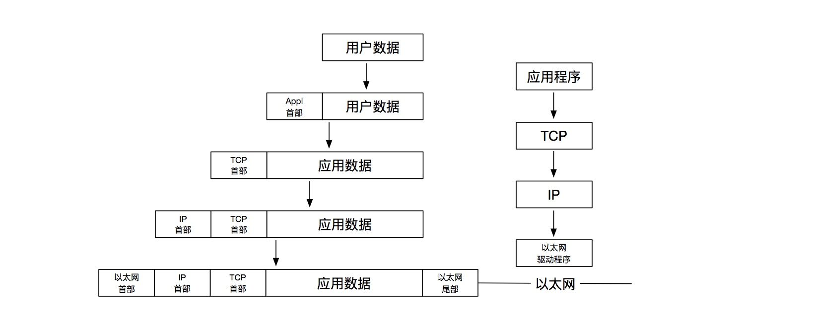

目录：

* [第一章概述](#第一章概述)


# 第一章概述

## 分层
同样，常见的五层协议

* 应用层
* 传输层（TCP）
* 网络层（IP）
* 链路层
* 物理层

传输层及其以下构成ICP/IP协议栈。其中，网络层IP提供的是一种不可靠的服务，它只是尽可能快得把分组从源
结点送到目的结点，但并不提供任何可靠性保证。另一方面，TCP在不可靠的IP层上提供了一个可靠的传输层，
为了提供这种可靠的服务，TCP采用了超时重传、发送和接收端到端的确认分组等机制。

> 连接网络的另一个途径是使用网桥。网桥是在链路层上对网络进行互连，而路由器则是在网络层上对网络进行
> 互连。网桥使得多个局域网(LAN)组合在一起，这样对上层来说就好像是一个局域网。

## 封装

当应用程序用TCP传送数据时，数据被送入协议栈中，然后逐个通过每一层直到被当作一串比特流送入网络。
其中每一层对收到的数据都要增加一些首部信息(有时还要增加尾部信息)，该过程如图1-7所示。TCP传给
IP的数据单元称作TCP报文段或简称为TCP段(TCPsegment)。IP传给网络接口层的数据单元称作IP数据报
(IPdatagram)。通过以太网传输的比特流称作帧(Frame)。

````
图1-7 数据进入协议栈时的封装过程
````



## 分用

当目的主机收到一个以太网数据帧时，数据就开始从协议栈中由底向上升，同时去掉各 层协议加上的报文首部。
每层协议盒都要去检查报文首部中的协议标识，以确定接收数据的上层协议,这个过程称作分用(Demultiplexing)。

## 端口号

* 1 ~ 255         知名端口号
* 256 ~ 1023      Unix系统占用
* 1024 ~ 5000     临时端口
* > 5000          为非Internet的其它服务器预留

# 链路层

## 


