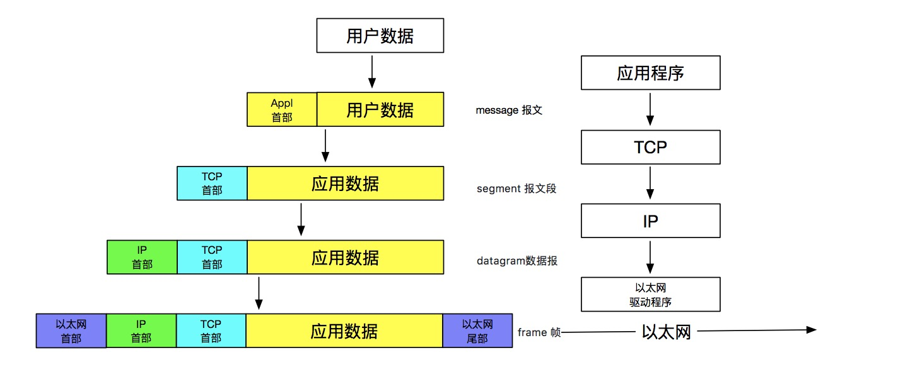
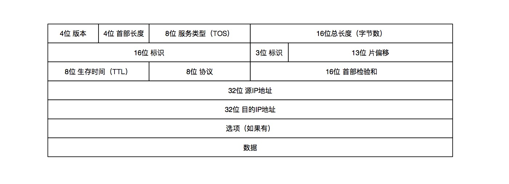

目录：

* [第一章概述](#第一章概述)


# 第一章概述

## 分层
同样，常见的五层协议

* 应用层
* 传输层（TCP）
* 网络层（IP）
* 链路层
* 物理层

传输层及其以下构成ICP/IP协议栈。其中，网络层IP提供的是一种不可靠的服务，它只是尽可能快得把分组从源
结点送到目的结点，但并不提供任何可靠性保证。另一方面，TCP在不可靠的IP层上提供了一个可靠的传输层，
为了提供这种可靠的服务，TCP采用了超时重传、发送和接收端到端的确认分组等机制。

> 连接网络的另一个途径是使用网桥。网桥是在链路层上对网络进行互连，而路由器则是在网络层上对网络进行
> 互连。网桥使得多个局域网(LAN)组合在一起，这样对上层来说就好像是一个局域网。

## 封装

当应用程序用TCP传送数据时，数据被送入协议栈中，然后逐个通过每一层直到被当作一串比特流送入网络。
其中每一层对收到的数据都要增加一些首部信息(有时还要增加尾部信息)，该过程如图1-7所示。TCP传给
IP的数据单元称作TCP报文段或简称为TCP段(TCPsegment)。IP传给网络接口层的数据单元称作IP数据报
(IPdatagram)。通过以太网传输的比特流称作帧(Frame)。

````
图1-7 数据进入协议栈时的封装过程
````



## 分用

当目的主机收到一个以太网数据帧时，数据就开始从协议栈中由底向上升，同时去掉各 层协议加上的报文首部。
每层协议盒都要去检查报文首部中的协议标识，以确定接收数据的上层协议,这个过程称作分用(Demultiplexing)。

## 端口号

* 1 ~ 255         知名端口号
* 256 ~ 1023      Unix系统占用
* 1024 ~ 5000     临时端口
* 5000 以上        为非Internet的其它服务器预留

# 第2章 链路层

## MTU 和 路径MTU

* MTU：以太网和802.3对数据帧的长度都有一个限制，其最大值分别是1500和1492字节。链路层的这个特性称作MTU，最大传输单元。
* 路径MTU：网络中，多台通信主机路径中的最小MTU，被称作路径MTU。不一定是个常数。它取决于当时所选择的路由。

## SLIP 和 CSLIP
略
* SLIP：
* CSLIP：压缩的SLIP

## 环回接口
TCP/IP 的本地通信

## 吞吐量计算
略

# 第3章 IP:网际协议

IP是TCP/IP协议族中最为核心的协议，提供不可靠、无连接的数据报传送服务。

* 不可靠：不可靠(unreliable)的意思是它不能保证IP数据报能成功地到达目的地。IP仅提供最好的传输服务。如果发生某种错误时，如某个路由器暂时用完了缓冲区，IP有一个简单的错误处理算法:丢弃该数据报，然后发送ICMP消息报给信源端。任何要求的可靠性必须由上层来提供(如TCP)。
* 无连接：无连接(connectionless)这个术语的意思是IP并不维护任何关于后续数据报的状态信息。每个数据报的处理是相互独立的。这也说明，IP数据报可以不按发送顺序接收。如果一信源向相同的信宿发送两个连续的数据报(先是A，然后是B)，每个数据报都是独立地进行路由选择，可能选择不同的路线，因此B可能在A到达之前先到达。


时延 & 吞吐量

* Telnet和Rlogin这两个交互应用要求最小的传输时延，因为人们主要用它们来传输少量的交互数据。
* 另一方面，FTP文件传输则要求有最大的吞吐量。最高可靠性被指明给网络管理(SNMP)和路由选择协议。
* 用户网络新闻(Usenetnews,NNTP)是唯一要求最小费用的应
用。

## IP首部

首部各个组成部分的具体含义，见 3.2 章节介绍，详解在后续章节。


## 第17章


## 第18章


